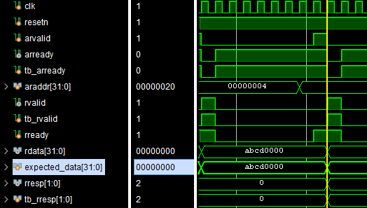

# AXI Lite Slave Interface

<!-- Banner Image -->


---

## About AXI Lite and AXI Full

The AXI Lite protocol is a lightweight subset of the full AXI (Advanced eXtensible Interface) protocol designed for simple, low-throughput control register access. Unlike AXI Full, which supports burst transactions and higher data throughput, AXI Lite handles single data transfers and is ideal for register-mapped peripherals with simpler requirements.

---

## AXI Lite Slave Interface Signals

| Signal Name    | Role Description                                               |
| -------------- | --------------------------------------------------------------|
| `s_axi_clk`    | Clock input for synchronous operation                          |
| `s_axi_resetn` | Active-low reset input, resets the AXI slave interface         |
| `s_axi_awaddr` | Write address bus                                              |
| `s_axi_awvalid`| Write address valid signal                                     |
| `s_axi_awready`| Write address ready signal                                     |
| `s_axi_wdata`  | Write data bus                                                |
| `s_axi_wstrb`  | Write strobes, byte-wise write enable                         |
| `s_axi_wvalid` | Write data valid signal                                       |
| `s_axi_wready` | Write data ready signal                                       |
| `s_axi_bresp`  | Write response status                                        |
| `s_axi_bvalid` | Write response valid signal                                  |
| `s_axi_bready` | Write response ready signal                                  |
| `s_axi_araddr` | Read address bus                                             |
| `s_axi_arvalid`| Read address valid signal                                    |
| `s_axi_arready`| Read address ready signal                                    |
| `s_axi_rdata`  | Read data bus                                               |
| `s_axi_rresp`  | Read response status                                      |
| `s_axi_rvalid` | Read data valid signal                                   |
| `s_axi_rready` | Read data ready signal                                   |

---

## Design Overview

This project implements a fully protocol-compliant AXI Lite Slave Interface in Verilog RTL. It features:

- Separate read and write address channels
- Full handshake support
- Address decode for multiple slave registers
- Response generation for invalid transactions

## RTL elaborated image
- TOP MODULE

- Internal View


The design is minimal in logic and resource usage, making it highly reusable and adaptable for various IP blocks.

---

## Resource Utilization

The module uses minimal FPGA resources and is optimized for efficient implementation.

<!-- Insert resource utilization image below -->


---

## Testbench Verification

All AXI Lite behaviors were tested with edge cases and stress conditions. Testbench written in SystemVerilog and executed using ModelSim.

### List of Verified Features:

1. Reset Verification  
2. Single Write Transaction  
3. Single Read Transaction  
4. Simultaneous Read and Write Transaction  
5. Invalid Write Address Transaction  
6. Invalid Read Address Transaction  
7. Back-to-Back Write Transactions  
8. Back-to-Back Read Transactions  
9. Back-to-Back Read + Write Combined  
10. WVALID Backpressure Test  
11. BREADY Backpressure Test  
12. RREADY Backpressure Test  

---

### 🔹 Reset Verification

Verifies slave resets all internal state correctly on `s_axi_resetn` assertion.


---

### 🔹 Single Write Transaction

Validates a proper AW-W-B write flow with correct acknowledgment and memory update.


---

### 🔹 Single Read Transaction

Confirms proper AR-R response and data retrieval from slave memory.


---

### 🔹 Simultaneous Read and Write Transaction

Tests parallel handling of read and write channels independently.


---

### 🔹 Invalid Write Address Transaction

Checks response for a write to an unmapped/invalid address.


---

### 🔹 Invalid Read Address Transaction

Checks response for a read from an unmapped/invalid address.



---

### 🔹 Back-to-Back Write Transactions

Tests pipelined write bursts with consecutive AW-W handshakes.


---

### 🔹 Back-to-Back Read Transactions

Tests pipelined reads with back-to-back AR handshakes.


---

### 🔹 Combined Back-to-Back Write + Read

Tests interleaved pipelined writes and reads.


---

### 🔹 WVALID Backpressure Test

Verifies proper slave stalling when WVALID asserted without WREADY available.


---

### 🔹 BREADY Backpressure Test

Checks slave behavior when master delays readout of write response.


---

### 🔹 RREADY Backpressure Test

Verifies slave stalls read channel when RREADY is low.


---

## Complete Waveform


## TCL Simulation Output

TCL script output from ModelSim simulation showing successful execution.


### Repository Structure
<pre><code>
  axi_lite_slave/
  ├── elaborated_design/         # RTL elaboration images
  ├── rtl/                       # RTL design files
  │   └── top_module.v           # s_axi_lite instantiated 
  |     └── s_axi_lite.v         # AXI Lite Slave RTL module
  ├── run/                       # Simulation scripts
  │   └── do_axi_lite.tcl        # ModelSim TCL script
  ├── simulated_waveform/        # Simulation waveform images
  ├── tb/                        # Testbench files
  │   └── s_axi_tb.sv            # SystemVerilog testbench
  ├── LICENSE                    # Project license (MIT)
  └── README.md                  # Project documentation
</code></pre>
### ▶️ Running Simulation

#### Prerequisites

- [ModelSim / QuestaSim](https://www.intel.com/content/www/us/en/software/programmable/quartus-prime/model-sim.html)

#### Run with TCL

Ensure ModelSim is installed and accessible from your command line.
Navigate to the repository root and execute:

```bash
vsim -do .run/do_axi_lite.tcl
```
---
## Further Usage
This AXI Lite slave interface can be directly used for:
1. IP creation and register mapping in Vivado / Quartus
2. Bridging to UART, SPI, I2C controllers
3. Peripheral register control in Zynq, MicroBlaze, or soft cores
4. AXI-based memory-mapped designs or testing

---

## License
This project is licensed under the MIT License.

---

## Acknowledgements
Thanks to the open-source FPGA and AXI communities for inspiration and technical resources.
- [AMD Xilinx AXI4-Lite Interface Documentation](https://docs.amd.com/r/en-US/pg202-mipi-dphy/AXI4-Lite-Interface) — for detailed specification and signal descriptions.

---

## Contact

For questions or feedback, please contact:  
**Divyajyoti Patra**  
Email: djpatra07@gmail.com  
LinkedIn: https://www.linkedin.com/in/divyajyoti-patra-185a13225/

